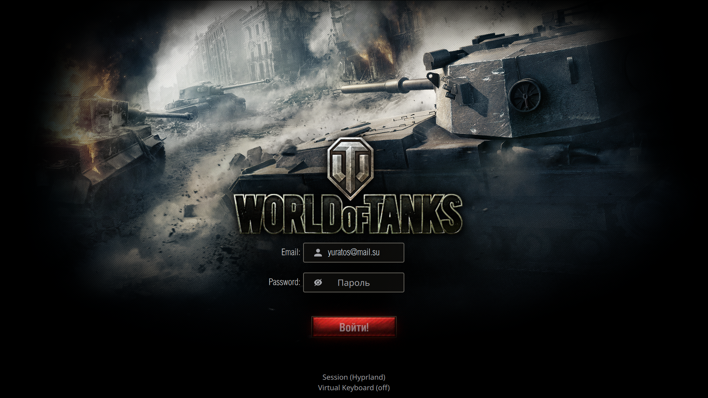
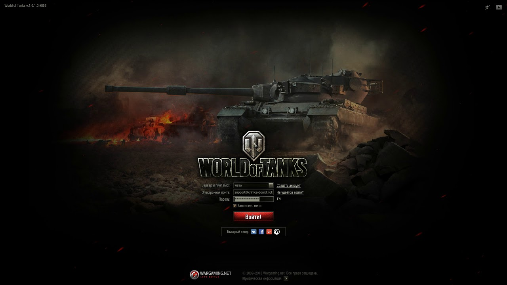

# World of Tanks Classic login theme
current view:


A sddm login theme looks like old login screen from World of Tanks.
It developed for Ximper Linux 0.9.4 Distro with Wayland compositor. <br> 

## **!!ATTENTION!!** <br> Compatibility with others distros not guaranteed!!!

referenced view:

## Files in this repo:
* **src** - Theme files
* **ximper** - Refernce theme<br> 
-------
## Development
to run in test view run:
```
 sddm-greeter-qt6 --test-mode --theme src
```
